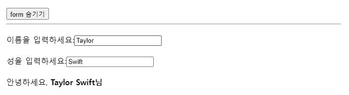

# useEffect로외부시스템과동기화

- 리액트 state와 관계없는 요소 직접제어

- 서버에서 데이터가져오기(fetch), 서버연결 설정, 로그 전송

- 브라우저 API 사용(window scroll이벤트, document)

- setTimeout, setInterval 타이머

- 위의 경우를 **리액트 컴포넌트 함수와 관계없는 사이드 이펙트**라 함

- 사이트이펙트에서 일어나는 일은 리엑트가 알 수 없으므로 **렌더링이 완료된후 실행되도록 useEffect**사용

- **사용자 인터렉션으로 인한 사이드이펙트는 이벤트 핸들러**에서 처리

- **서버에서 데이터가져오기는 이벤트와 관계없으므로 useEffect**에서 처리

- 화면 렌더링된 후 입력필드에 포커스 보내려면 useEffect 

- **useEffect 선언 > 의존성배열에 의존성지정 > 필요하면 클린업 함수 추가**

- **useEffect는 화면에 렌더링이 반영될 때까지 코드 실행을 “지연”시킴**

## 비디오 재생 토글하기

- 렌더링 중에 dom을 조작할 수 없음(리액트가 변경사항을 알 수 없으므로)

- play()를 호출할 비디오가 반환되기 전이므로 호출되지않음

```js
import './App.css';
import { useState, useRef, useEffect } from 'react';

function VideoPlayer({ src, isPlaying }) {
  const ref = useRef(null);

  if (isPlaying) {
    ref.current.play(); // 렌더링 중에 이를 호출하는 것이 허용되지 않습니다.
  } else {
    ref.current.pause(); // 역시 이렇게 호출하면 바로 위의 호출과 충돌이 발생합니다.
  }

  return <video ref={ref} src={src} loop playsInline />;
}

export default function App() {
  const [isPlaying, setIsPlaying] = useState(false);
  return (
    <>
      <button onClick={() => setIsPlaying(!isPlaying)}>
        {isPlaying ? '일시정지' : '재생'}
      </button>
      <VideoPlayer
        isPlaying={isPlaying}
        src="https://interactive-examples.mdn.mozilla.net/media/cc0-videos/flower.mp4"
      />
    </>
  );
}
```

- dom 조작코드를 useEffect로 감싸 렌더링이 완료된후 실행되도록 해줌

- 외부시스템(브라우저 미디어 API)과 리액트 상태 동기화 - useEffect

```js
import './App.css';
import { useState, useRef, useEffect } from 'react';

function VideoPlayer({ src, isPlaying }) {
  const ref = useRef(null);

  useEffect(() => {
    if (isPlaying) {
      ref.current.play();
    } else {
      ref.current.pause();
    }
  });

  return <video ref={ref} src={src} loop playsInline />;
}

export default function App() {
  const [isPlaying, setIsPlaying] = useState(false);
  return (
    <>
      <button type="button" onClick={() => setIsPlaying(!isPlaying)}>
        {isPlaying ? '일시 정지' : '재생'}
      </button>
      <VideoPlayer
        isPlaying={isPlaying}
        src="https://interactive-examples.mdn.mozilla.net/media/cc0-videos/flower.mp4"
      />
    </>
  );
}
```

### useEffect안에서 상태변경하면 안됨! - 무한루프 발생

- 상태가 변경되면 렌더링 일어나며 렌더링후 이펙트 실행 -> 상태변경 -> 이펙트 실행 무한루프

```js
const [count, setCount] = useState(0);

useEffect(() => {
  setCount(count + 1);
});
```

## useEffect에 의존성 없을 경우 매 렌더링마다 실행됨

```js
import { useState, useRef, useEffect } from 'react';

function VideoPlayer({ src, isPlaying }) {
  const ref = useRef(null);

  useEffect(() => {
    if (isPlaying) {
      console.log('video.play() 호출');
      ref.current.play();
    } else {
      console.log('video.pause() 호출');
      ref.current.pause();
    }
  });

  return <video ref={ref} src={src} loop playsInline />;
}

export default function App() {
  const [isPlaying, setIsPlaying] = useState(false);
  const [text, setText] = useState('');
  return (
    <>
      <input value={text} onChange={e => setText(e.target.value)} />
      <button onClick={() => setIsPlaying(!isPlaying)}>
        {isPlaying ? '일시 정지' : '재생'}
      </button>
      <VideoPlayer
        isPlaying={isPlaying}
        src="https://interactive-examples.mdn.mozilla.net/media/cc0-videos/flower.mp4"
      />
    </>
  );
}
```

## useEffect 의존성 배열 지정

- 불필요하게 다시 실행되지않도록 해줌

- 빈배열 입력시 한번만 실행되며 의존성필요시 에러 발생시켜줌

- 의존성배열에 지정된 값이 변경될 때만 다시 실행

```js
  useEffect(() => {
    // ...
  }, []);
```

```js
useEffect(() => {
    if (isPlaying) { // 여기서 사용하니까...
      // ...
    } else {
      // ...
    }
  }, [isPlaying]); // ...여기에 선언되어야겠네!
```

```js
import { useState, useRef, useEffect } from 'react';

function VideoPlayer({ src, isPlaying }) {
  const ref = useRef(null);

  useEffect(() => {
    if (isPlaying) {
      console.log('video.play() 호출');
      ref.current.play();
    } else {
      console.log('video.pause() 호출');
      ref.current.pause();
    }
  }, [isPlaying]);

  return <video ref={ref} src={src} loop playsInline />;
}

export default function App() {
  const [isPlaying, setIsPlaying] = useState(false);
  const [text, setText] = useState('');
  return (
    <>
      <input value={text} onChange={e => setText(e.target.value)} />
      <button onClick={() => setIsPlaying(!isPlaying)}>
        {isPlaying ? '일시 정지' : '재생'}
      </button>
      <VideoPlayer
        isPlaying={isPlaying}
        src="https://interactive-examples.mdn.mozilla.net/media/cc0-videos/flower.mp4"
      />
    </>
  );
}
```

## useEffect 의존성배열에 따른 동작

```js
useEffect(() => {
  // 모든 렌더링 후에 실행됩니다
});

useEffect(() => {
  // 마운트될 때만 실행됩니다 (컴포넌트가 나타날 때)
}, []);

useEffect(() => {
 // 마운트될 때 실행되며, *또한* 렌더링 이후에 a 또는 b 중 하나라도 변경된 경우에도 실행됩니다
}, [a, b]);
```

## useEffect 클린업함수

- addEventListener사용시 클린업 해야함

- **클린업 함수는 이펙트를 사용하는 컴포넌트가 화면에서 사라질때 실행**되므로 클린업을 하지않으면 요소가 사라져도 스크롤이벤트가 계속 발생

```js
useEffect(() => {
  function handleScroll(e) {
    console.log(window.scrollX, window.scrollY);
  }
  window.addEventListener('scroll', handleScroll);
  return () => window.removeEventListener('scroll', handleScroll);
}, []);
```

## Effect가 아닌 경우: 애플리케이션 초기화

- 인증관련, 로컬 스토리지등 초기화관련은 시작시 한번만 실행되야하므로 컴포넌트 위에서 실행하면 초기에 한번만 실행됨

```js
if (typeof window !== 'undefined') { // 브라우저에서 실행 중인지 확인합니다.
  checkAuthToken();
  loadDataFromLocalStorage();
}

function App() {
  // ...
}
```

## Effect가 아닌 경우: 제품 구입 POST 요청

- post요청: 사용자가 입력한 폼 제출, 데이터를 서버로 전송하는 HTTP 메서드

- 로그인정보, 회원가입 양식, 제품구매 양식을 URL에 노출하지않고 HTTP 요청 본문에 포함하여 서버로 전송

```js
useEffect(() => {
  // 🔴 잘못된 방법: 이 Effect는 개발 환경에서 두 번 실행되며 코드에 문제가 드러납니다.
  fetch('/api/buy', { method: 'POST' });
}, []);
```

- 사용자가 페이지에 방문할 때 제품을 구매하지않으며 **구매 버튼 클릭시 제품을 구매하므로 이벤트 핸들러에서 처리**해야함

```js
function handleClick() {
  // ✅ 구매는 특정 상호 작용에 의해 발생하는 이벤트입니다.
  fetch('/api/buy', { method: 'POST' });
}
```

## 요약

- 이벤트와 달리 Effect는 특정 상호작용이 아닌 렌더링 자체에 의해 발생합니다.
- Effect를 사용하면 컴포넌트를 외부 시스템(타사 API, 네트워크, DOM 직접조작, 타이머함수 등)과 동기화할 수 있습니다.
- 기본적으로 Effect는 모든 렌더링(초기 렌더링 포함) 후에 실행됩니다.
- React는 모든 의존성이 마지막 렌더링과 동일한 값을 가지면 Effect를 건너뜁니다.
- 의존성을 “선택”할 수 없습니다. 의존성은 Effect 내부의 코드에 의해 결정됩니다.
- 빈 의존성 배열(`[]`)은 컴포넌트 “마운팅”(화면에 추가됨)시 한번만 실행을 의미
- Strict Mode에서 React는 컴포넌트를 두 번 마운트합니다(개발 환경에서만!) 이는 Effect의 스트레스 테스트를 위한 것입니다.
- Effect가 다시 마운트로 인해 중단된 경우 클린업 함수를 구현해야 합니다.
- React는 Effect가 다음에 실행되기 전에 정리 함수를 호출하며, 언마운트 중에도 호출합니다.

## 챌린지: 마운트시 입력필드에 포커스하기

```js
import './App.css';
import { useState, useRef, useEffect } from 'react';

export default function MyInput() {
  const inputRef = useRef(null);

  // TODO: 작동하지 않는다. 고쳐야함
  inputRef.current.focus();

  return <input ref={inputRef} />;
}
```

## 챌린지: 조건부로 입력필드에 포커스하기

- 두개의 입력필드에 focus() 연속호출시 마지막 호출에 의해 두번째 입력필드에 포커스 되며 조건을 통해 첫번째 입력필드에 포커스하기

```js
// MyInput.jsx
import { useEffect, useRef } from 'react';

export default function MyInput({ shouldFocus, value, onChange }) {
  const ref = useRef(null);

  useEffect(() => {
    ref.current.focus();
  }, []);

  return <input ref={ref} value={value} onChange={onChange} />;
}
```



## 챌린지: 두 번 실행되는 interval 고치기

- strict모드에 의해 개발시 초기 렌더링이 두번 실행(effect 스트레스 테스트)되며 두번 실행되더라도 useEffect의 코드에 문제가 없어야함

```js
// Counter.js
import { useState, useEffect } from 'react';

export default function Counter() {
  const [count, setCount] = useState(0);

  useEffect(() => {
    function onTick() {
      setCount((c) => c + 1);
    }

    setInterval(onTick, 1000);
  }, []);

  return <h1>{count}</h1>;
}
```
